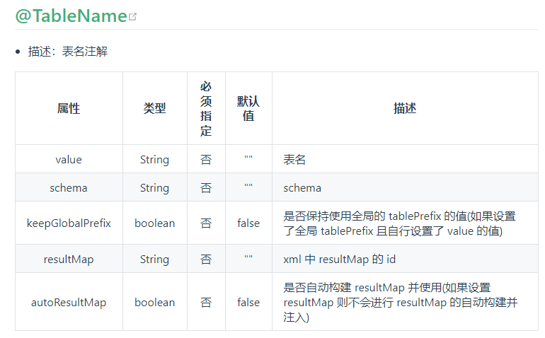
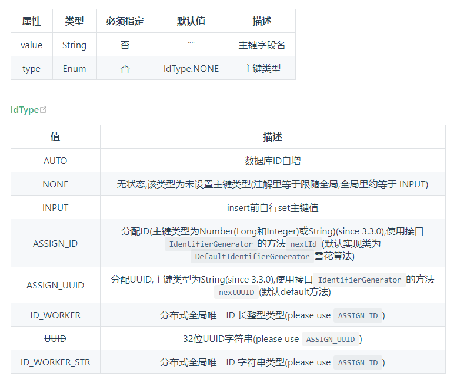
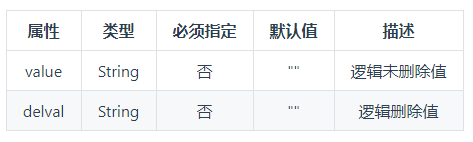
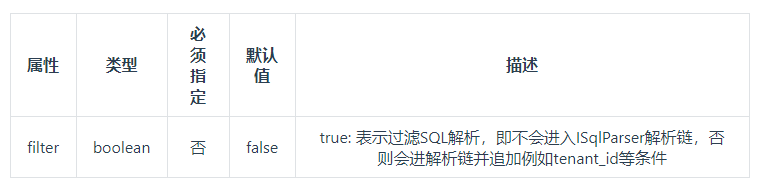
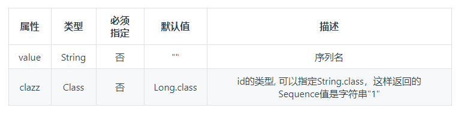

# mybatis-plus
SpringBoot整合Mybatis-Plus学习

[官方地址](https://baomidou.com/)

# 体验Mybatis-plus

- 创建数据库并且插入数据

```jshelllanguage

DROP TABLE IF EXISTS USER;

CREATE TABLE USER
(
	id BIGINT(20) NOT NULL COMMENT '主键ID',
	NAME VARCHAR(30) NULL DEFAULT NULL COMMENT '姓名',
	age INT(11) NULL DEFAULT NULL COMMENT '年龄',
	email VARCHAR(50) NULL DEFAULT NULL COMMENT '邮箱',
	PRIMARY KEY (id)
);

INSERT INTO USER (id, NAME, age, email) VALUES
(1, 'Jone', 18, 'test1@baomidou.com'),
(2, 'Jack', 20, 'test2@baomidou.com'),
(3, 'Tom', 28, 'test3@baomidou.com'),
(4, 'Sandy', 21, 'test4@baomidou.com'),
(5, 'Billie', 24, 'test5@baomidou.com');

SELECT * FROM USER;
```

- 初始化工程
    - 添加依赖
    
    ```xml
    
   #数据源配置
   spring:
      datasource:
      driver-class-name: com.mysql.jdbc.Driver
      url: jdbc:mysql://localhost:3306/mybatis-plus?useSSL=false&useUnicode=true&characterEncoding=utf-8
      username: root
      password: 123456


    ```

    - 编写实体类

    ```java
    package com.ryan.quickstart.entity;
    
    import lombok.Data;
    
    @Data
    public class User {
    
        private int id;
        private String name;
        private int age;
        private String email;
    }
   ```

    - Spring Boot 启动类中添加 @MapperScan 注解，扫描 Mapper 文件夹

    ```java
    package com.ryan.quickstart;
    
    import org.mybatis.spring.annotation.MapperScan;
    import org.springframework.boot.SpringApplication;
    import org.springframework.boot.autoconfigure.SpringBootApplication;
    
    @SpringBootApplication
    @MapperScan(value = "com.ryan.quickstart.mapper")
    public class QuickStartApplication {
    
        public static void main(String[] args) {
            SpringApplication.run(QuickStartApplication.class, args);
        }
    
    }
    
    ```

    - 编写Mapper类

    ```java
    
    package com.ryan.quickstart.mapper;
    
    import com.baomidou.mybatisplus.core.mapper.BaseMapper;
    import com.ryan.quickstart.entity.User;
    
    public interface UserMapper extends BaseMapper<User> {
    }
    
    ```

    - 编写测试类

    ```java
    package com.ryan.quickstart;
    
    import com.ryan.quickstart.entity.User;
    import com.ryan.quickstart.mapper.UserMapper;
    import org.junit.Assert;
    import org.junit.Test;
    import org.junit.runner.RunWith;
    import org.springframework.boot.test.context.SpringBootTest;
    import org.springframework.test.context.junit4.SpringRunner;
    
    import javax.annotation.Resource;
    import java.util.List;
    
    @RunWith(SpringRunner.class)
    @SpringBootTest
    public class MybatisPlusTest {
    
        @Resource
        private UserMapper userMapper;
    
    
        @Test
        public void testSelect() {
            System.out.println(("----- selectAll method test ------"));
            List<User> userList = userMapper.selectList(null);
            Assert.assertEquals(5, userList.size());
            userList.forEach(System.out::println);
        }
    
    }
    
    ```
  
    - 结果输出
    
    ```java
    User(id=1, name=Jone, age=18, email=test1@baomidou.com)
    User(id=2, name=Jack, age=20, email=test2@baomidou.com)
    User(id=3, name=Tom, age=28, email=test3@baomidou.com)
    User(id=4, name=Sandy, age=21, email=test4@baomidou.com)
    User(id=5, name=Billie, age=24, email=test5@baomidou.com)
    ```
  
  
- 小结

    相对于Mybatis来说，Mybatis-plus更加的简洁，只需要导入依赖，并配置扫描Mapper路径就可以了，就可以完成简单的CURD操作了。
    
    

# 注解（annotation）

@TableName

description： 表名注解

Attribute value：
    
   
   
@TableId

description：主键注解

Attribute value：
   
   

@TableField

description：字段注解（非主键）

Attribute value

```t```

| 属性        | 类型    |  必须指定  |  默认值  | 描述  |
    | --------   | -----:   | :----: |:----: |:----: |
    | value       | String      |   否    | ""    |   数据库字段名    |
    | exist        | Boolean      |   否    | true   |   是否为数据库表字段    |
    | el        | String     |   否    | ""    |   映射为原生 #{ ... } 逻辑,相当于写在 xml 里的 #{ ... } 部分    |


@Version

description：乐观锁注解、标记 @Verison 在字段上

@EnumValue

description:通枚举类注解(注解在枚举字段上)

Attribute value


@TableLogic

description:表字段逻辑处理注解（逻辑删除）

value




@SqlParser

description：租户注解,支持method上以及mapper接口上

value




@KeySequence

description：序列主键策略 oracle

value：value、resultMap




# CURD接口

#### Mapper CURD

- insert操作

    ```java
    package com.ryan.crud;
    
    import com.ryan.crud.mapper.UserMapper;
    import entity.User;
    import lombok.extern.slf4j.Slf4j;
    import org.junit.jupiter.api.Test;
    import org.springframework.beans.factory.annotation.Autowired;
    import org.springframework.boot.test.context.SpringBootTest;
    
    import javax.annotation.Resource;
    
    @Slf4j
    @SpringBootTest
    class ServiceCrudApplicationTests {
    
        @Resource
        private UserMapper userMapper;
    
        @Test
        void contextLoads() {
    
            int ryan = userMapper.insert(new User(6,"Ryan", 6, "1312170600@qq.com"));
            log.info(ryan+"");
        }
    
    }
    ```
  
  - insert引申扩展
  
    1. 主键策略
    
        注解@TableId
        
        - IdType.AUTO 
             
            数据库ID自增
            
            ```java
               //测试主键策略AUTO
               User user = new User();
               user.setName("fuyi");
               user.setEmail("32894899@qq.com");
               user.setAge(18);
               int ryan = userMapper.insert(user);
               log.info(ryan+"");
           ```
           测试结果
           
           ```text
            Creating a new SqlSession
            SqlSession [org.apache.ibatis.session.defaults.DefaultSqlSession@ef60710] was not registered for synchronization because synchronization is not active
            2020-09-16 11:18:28.947  INFO 3392 --- [           main] com.zaxxer.hikari.HikariDataSource       : HikariPool-1 - Starting...
            2020-09-16 11:18:29.303  INFO 3392 --- [           main] com.zaxxer.hikari.HikariDataSource       : HikariPool-1 - Start completed.
            JDBC Connection [HikariProxyConnection@1664927413 wrapping com.mysql.jdbc.JDBC4Connection@6342ff7f] will not be managed by Spring
            ==>  Preparing: INSERT INTO user ( name, age, email ) VALUES ( ?, ?, ? )
            ==> Parameters: fuyi(String), 18(Integer), 32894899@qq.com(String)
            <==    Updates: 1
            Closing non transactional SqlSession [org.apache.ibatis.session.defaults.DefaultSqlSession@ef60710]
            ```
             
        **注意**：id字段在数据表中必须设置称自动增加不然，无法插入数据。
        
        - IdType.NONE      
        
            无状态,该类型为未设置主键类型(注解里等于跟随全局,全局里约等于 INPUT)
        
        - IdType.INPUT     
        
            insert前自行set主键值
        
        - IdType.ASSIGN_ID 
        
            分配ID(主键类型为Number(Long和Integer)或String)(since 3.3.0),使用接口IdentifierGenerator的方法nextId(默认实现类为DefaultIdentifierGenerator雪花算法)
            
            实体类
          ```java
              package entity;
              
              import com.baomidou.mybatisplus.annotation.IdType;
              import com.baomidou.mybatisplus.annotation.TableId;
              import com.baomidou.mybatisplus.core.mapper.BaseMapper;
              import lombok.AllArgsConstructor;
              import lombok.Data;
              import lombok.EqualsAndHashCode;
              import lombok.NoArgsConstructor;
              
              import static com.baomidou.mybatisplus.annotation.IdType.*;
              
              /**
               * <p>
               *
               * </p>
               *
               * @author fuyi
               * @since 2020-09-15
               */
              @Data
              @EqualsAndHashCode()
              @AllArgsConstructor
              @NoArgsConstructor
              public class User{
              
                  @TableId(type = ASSIGN_ID)
                  private Long id;
                  /**
                   * 姓名
                   */
                  private String name;
              
                  /**
                   * 年龄
                   */
                  private Integer age;
              
                  /**
                   * 邮箱
                   */
                  private String email;
              
              
              }

             ```
          
            测试代码
            ```java
          //测试主键策略ASSIGN_ID
          User user = new User();
          user.setName("xiaobai");
          user.setEmail("32894899883@qq.com");
          user.setAge(20);
          int ryan = userMapper.insert(user);
             ```
          
            测试结果
            ```text
                Creating a new SqlSession
                SqlSession [org.apache.ibatis.session.defaults.DefaultSqlSession@2503ec73] was not registered for synchronization because synchronization is not active
                2020-09-16 11:26:22.691  INFO 6820 --- [           main] com.zaxxer.hikari.HikariDataSource       : HikariPool-1 - Starting...
                2020-09-16 11:26:23.055  INFO 6820 --- [           main] com.zaxxer.hikari.HikariDataSource       : HikariPool-1 - Start completed.
                JDBC Connection [HikariProxyConnection@1416977881 wrapping com.mysql.jdbc.JDBC4Connection@f1f7db2] will not be managed by Spring
                ==>  Preparing: INSERT INTO user ( id, name, age, email ) VALUES ( ?, ?, ?, ? )
                ==> Parameters: 1306071905983332353(Long), xiaobai(String), 20(Integer), 32894899883@qq.com(String)
                <==    Updates: 1
                Closing non transactional SqlSession [org.apache.ibatis.session.defaults.DefaultSqlSession@2503ec73]
             ```
        - IdType.ASSIGN_UUID 
        
            分配UUID,主键类型为String(since 3.3.0),使用接口IdentifierGenerator的方法nextUUID(默认default方法)
            
            实体类
            ```java
                @TableId(type = ASSIGN_UUID)
                private String id;
                /**
                 * 姓名
                 */
                private String name;
            
                /**
                 * 年龄
                 */
                private Integer age;
            
                /**
                 * 邮箱
                 */
                private String email;
             ```   
            
            测试代码
            
            ```java
                //测试主键策略ASSIGN_UUID
                User user = new User();
                user.setName("hei");
                user.setEmail("321999899883@qq.com");
                user.setAge(40);
                userMapper.insert(user);
             ```                              
            测试结果
            
            ```text
            Creating a new SqlSession
            SqlSession [org.apache.ibatis.session.defaults.DefaultSqlSession@65ddee5a] was not registered for synchronization because synchronization is not active
            2020-09-16 11:34:33.696  INFO 9376 --- [           main] com.zaxxer.hikari.HikariDataSource       : HikariPool-1 - Starting...
            2020-09-16 11:34:34.059  INFO 9376 --- [           main] com.zaxxer.hikari.HikariDataSource       : HikariPool-1 - Start completed.
            JDBC Connection [HikariProxyConnection@1202790087 wrapping com.mysql.jdbc.JDBC4Connection@58fa5769] will not be managed by Spring
            ==>  Preparing: INSERT INTO user ( id, name, age, email ) VALUES ( ?, ?, ?, ? )
            ==> Parameters: 783a264a1f79554e31b8a6edee5ef996(String), hei(String), 40(Integer), 321999899883@qq.com(String)
            <==    Updates: 1
            Closing non transactional SqlSession [org.apache.ibatis.session.defaults.DefaultSqlSession@65ddee5a]
            ```
            
        - IdType.ID_WORKER
        
            分布式全局唯一ID 长整型类型(please use ASSIGN_ID)
            
        - IdType.ID_UUID
        
            32位UUID字符串(please use ASSIGN_UUID)
            
        - IdType.ID_WORKER_STR
        
            分布式全局唯一ID 字符串类型(please use ASSIGN_ID）
            

- select操作

    ```java
        //获取全部
        List<User> users = userMapper.selectList(null);
        for (User u: users) {
            log.info(u.toString());
        }
    ```
    测试结果
    
    ```text
    Creating a new SqlSession
    SqlSession [org.apache.ibatis.session.defaults.DefaultSqlSession@44b21f9f] was not registered for synchronization because synchronization is not active
    2020-09-16 11:39:42.102  INFO 7132 --- [           main] com.zaxxer.hikari.HikariDataSource       : HikariPool-1 - Starting...
    2020-09-16 11:39:42.468  INFO 7132 --- [           main] com.zaxxer.hikari.HikariDataSource       : HikariPool-1 - Start completed.
    JDBC Connection [HikariProxyConnection@1874919946 wrapping com.mysql.jdbc.JDBC4Connection@5762658b] will not be managed by Spring
    ==>  Preparing: SELECT id,name,age,email FROM user
    ==> Parameters: 
    <==    Columns: id, name, age, email
    <==        Row: 1, Jone, 18, test1@baomidou.com
    <==        Row: 1306071905983332353, xiaobai, 20, 32894899883@qq.com
    <==        Row: 2, Jack, 20, test2@baomidou.com
    <==        Row: 3, Tom, 28, test3@baomidou.com
    <==        Row: 4, Sandy, 21, test4@baomidou.com
    <==        Row: 5, Billie, 24, test5@baomidou.com
    <==        Row: 6, Ryan, 6, 1312170600@qq.com
    <==        Row: 7, fuyi, 18, 32894899@qq.com
    <==        Row: 783a264a1f79554e31b8a6edee5ef996, hei, 40, 321999899883@qq.com
    <==      Total: 9
    Closing non transactional SqlSession [org.apache.ibatis.session.defaults.DefaultSqlSession@44b21f9f]
    2020-09-16 11:39:42.514  INFO 7132 --- [           main] c.ryan.crud.ServiceCrudApplicationTests  : User(id=1, name=Jone, age=18, email=test1@baomidou.com)
    2020-09-16 11:39:42.514  INFO 7132 --- [           main] c.ryan.crud.ServiceCrudApplicationTests  : User(id=1306071905983332353, name=xiaobai, age=20, email=32894899883@qq.com)
    2020-09-16 11:39:42.514  INFO 7132 --- [           main] c.ryan.crud.ServiceCrudApplicationTests  : User(id=2, name=Jack, age=20, email=test2@baomidou.com)
    2020-09-16 11:39:42.514  INFO 7132 --- [           main] c.ryan.crud.ServiceCrudApplicationTests  : User(id=3, name=Tom, age=28, email=test3@baomidou.com)
    2020-09-16 11:39:42.514  INFO 7132 --- [           main] c.ryan.crud.ServiceCrudApplicationTests  : User(id=4, name=Sandy, age=21, email=test4@baomidou.com)
    2020-09-16 11:39:42.514  INFO 7132 --- [           main] c.ryan.crud.ServiceCrudApplicationTests  : User(id=5, name=Billie, age=24, email=test5@baomidou.com)
    2020-09-16 11:39:42.514  INFO 7132 --- [           main] c.ryan.crud.ServiceCrudApplicationTests  : User(id=6, name=Ryan, age=6, email=1312170600@qq.com)
    2020-09-16 11:39:42.514  INFO 7132 --- [           main] c.ryan.crud.ServiceCrudApplicationTests  : User(id=7, name=fuyi, age=18, email=32894899@qq.com)
    2020-09-16 11:39:42.514  INFO 7132 --- [           main] c.ryan.crud.ServiceCrudApplicationTests  : User(id=783a264a1f79554e31b8a6edee5ef996, name=hei, age=40, email=321999899883@qq.com)
    ```
    
  - select操作扩展
  
    1. 条件构造器（Wrapper）
    

- update操作

    ```java
        //更新操作
        User user = new User();
        user.setId("783a264a1f79554e31b8a6edee5ef996");
        user.setName("nan");
        user.setEmail("321999899883@qq.com");
        user.setAge(38);
        userMapper.updateById(user);
    ```
  
    执行结果
    
    ```text
    Creating a new SqlSession
    SqlSession [org.apache.ibatis.session.defaults.DefaultSqlSession@6a87026] was not registered for synchronization because synchronization is not active
    2020-09-16 11:47:20.495  INFO 968 --- [           main] com.zaxxer.hikari.HikariDataSource       : HikariPool-1 - Starting...
    2020-09-16 11:47:20.849  INFO 968 --- [           main] com.zaxxer.hikari.HikariDataSource       : HikariPool-1 - Start completed.
    JDBC Connection [HikariProxyConnection@2107841088 wrapping com.mysql.jdbc.JDBC4Connection@28ee7bee] will not be managed by Spring
    ==>  Preparing: UPDATE user SET name=?, age=?, email=? WHERE id=?
    ==> Parameters: nan(String), 38(Integer), 321999899883@qq.com(String), 783a264a1f79554e31b8a6edee5ef996(String)
    <==    Updates: 1
    Closing non transactional SqlSession [org.apache.ibatis.session.defaults.DefaultSqlSession@6a87026]
    ```
  
  - 扩展
    
    1. 乐观锁
    
        每次去获取数据的时候，总是认为数据不会被修改，不会上锁，只是在更新的时候通过版本号机制和和CAS算法进行判断是否有人在这期间更新这个数据。
    
    2. 悲观锁
    
        和乐观锁恰恰相反，总是认为数据会被修改，每次操作数据的时候，都会上锁，知道操作完数据才会释放资源。
        
    乐观锁的执行方式
        
    - 取出数据时，获取当前的version
    
    - 更新的时候带上这个version
    
    - 执行更新时候，set version = new version where version = old vesion
    
    - 如果version不对，则更新失败
    
     实现原理
     
     ```sql
     -- A线程执行更新操作
     update user set name = "fuyi", version = version + 1 where id = 2 and version = 1;
     
     -- B线程也更新数据
     update user set name = "xiaohung", version = version + 1 where id = 2 and version = 1;
     ```
     虽然A线程首先开始执行更新操作，但是后面的B线程后来居上，首先完成更新操作，此时记录中的version = 2，因为A线程在执行更新操作之前首先先查询
     
     version值并记录（此时为1），当执行更新的时候，发现version已经发生变化，导致更新失败，以此来实现线程间的通信安全。
           
    Mybatis-Plus实现乐观锁
    
    1. 数据表中添加version字段，并赋值为1
    
    2. 同步实体类
    
    ```java
        package com.ryan.crud.entity;
        
        import com.baomidou.mybatisplus.annotation.Version;
        import lombok.AllArgsConstructor;
        import lombok.Data;
        import lombok.NoArgsConstructor;
        
        @Data
        @AllArgsConstructor
        @NoArgsConstructor
        public class User {
            private Long id;
            private String name;
            private Integer age;
            private String email;
        
            @Version
            private Integer version;
        }

     ```
    
    3. 配置乐观锁拦截器
    
    ```java
        package com.ryan.crud.config;
        
        import com.baomidou.mybatisplus.extension.plugins.OptimisticLockerInterceptor;
        import org.mybatis.spring.annotation.MapperScan;
        import org.springframework.context.annotation.Bean;
        import org.springframework.context.annotation.Configuration;
        import org.springframework.transaction.annotation.EnableTransactionManagement;
        
        @Configuration
        @EnableTransactionManagement   //开启事务管理
        @MapperScan("com.ryan.crud.mapper")
        public class MybatisPlusConfig {
        
            //乐观锁配置
            @Bean
            public OptimisticLockerInterceptor optimisticLockerInterceptor() {
                return new OptimisticLockerInterceptor();
            }
        }

     ```
    
    4. 测试
    
    ```java
    @Test
    void OptimisticLockerSuccessTest() {
        //乐观锁成功
        User user = userMapper.selectById(1);
        log.info("更新前：" + user.toString());
        user.setAge(100);
        user.setName("xiaofan");
        userMapper.updateById(user);
        log.info("更新后：" + user.toString());
        }
     ```
    
    结果打印
    
    ```text
    Creating a new SqlSession
    SqlSession [org.apache.ibatis.session.defaults.DefaultSqlSession@3ae126d1] was not registered for synchronization because synchronization is not active
    2020-09-16 23:07:02.877  INFO 4376 --- [           main] com.zaxxer.hikari.HikariDataSource       : HikariPool-1 - Starting...
    2020-09-16 23:07:03.339  INFO 4376 --- [           main] com.zaxxer.hikari.HikariDataSource       : HikariPool-1 - Start completed.
    JDBC Connection [HikariProxyConnection@598284487 wrapping com.mysql.jdbc.JDBC4Connection@7a45d714] will not be managed by Spring
    ==>  Preparing: SELECT id,name,age,email,version FROM user WHERE id=?
    ==> Parameters: 1(Integer)
    <==    Columns: id, name, age, email, version
    <==        Row: 1, Jone, 18, test1@baomidou.com, 1
    <==      Total: 1
    Closing non transactional SqlSession [org.apache.ibatis.session.defaults.DefaultSqlSession@3ae126d1]
    2020-09-16 23:07:03.468  INFO 4376 --- [           main] c.ryan.crud.ServiceCrudApplicationTests  : 更新前：User(id=1, name=Jone, age=18, email=test1@baomidou.com, version=1)
    Creating a new SqlSession
    SqlSession [org.apache.ibatis.session.defaults.DefaultSqlSession@2f7efd0b] was not registered for synchronization because synchronization is not active
    JDBC Connection [HikariProxyConnection@295372946 wrapping com.mysql.jdbc.JDBC4Connection@7a45d714] will not be managed by Spring
    ==>  Preparing: UPDATE user SET name=?, age=?, email=?, version=? WHERE id=? AND version=?
    ==> Parameters: xiaofan(String), 100(Integer), test1@baomidou.com(String), 2(Integer), 1(Long), 1(Integer)
    <==    Updates: 1
    Closing non transactional SqlSession [org.apache.ibatis.session.defaults.DefaultSqlSession@2f7efd0b]
    2020-09-16 23:07:03.549  INFO 4376 --- [           main] c.ryan.crud.ServiceCrudApplicationTests  : 更新后：User(id=1, name=xiaofan, age=100, email=test1@baomidou.com, version=2)
    ```
    
    ```java
        @Test
        void OptimisticLockerFailTest() {
            //乐观锁失败
            User user = userMapper.selectById(1);
            log.info("更新前：" + user.toString());
            user.setAge(180);
            user.setName("xiaofan");
    
            //模拟线程插队操作
            User user2 = userMapper.selectById(1);
            user2.setAge(60);
            user2.setName("插队");
    
            userMapper.updateById(user);
            log.info("更新后：" + user.toString());
    
        }
    ```
    
    结果打印
    
    ```text
    Creating a new SqlSession
    SqlSession [org.apache.ibatis.session.defaults.DefaultSqlSession@4397a639] was not registered for synchronization because synchronization is not active
    2020-09-16 23:17:59.277  INFO 17776 --- [           main] com.zaxxer.hikari.HikariDataSource       : HikariPool-1 - Starting...
    2020-09-16 23:17:59.679  INFO 17776 --- [           main] com.zaxxer.hikari.HikariDataSource       : HikariPool-1 - Start completed.
    JDBC Connection [HikariProxyConnection@955743449 wrapping com.mysql.jdbc.JDBC4Connection@4a8e6e89] will not be managed by Spring
    ==>  Preparing: SELECT id,name,age,email,version FROM user WHERE id=?
    ==> Parameters: 1(Integer)
    <==    Columns: id, name, age, email, version
    <==        Row: 1, xiaofan, 100, test1@baomidou.com, 2
    <==      Total: 1
    Closing non transactional SqlSession [org.apache.ibatis.session.defaults.DefaultSqlSession@4397a639]
    2020-09-16 23:17:59.734  INFO 17776 --- [           main] c.ryan.crud.ServiceCrudApplicationTests  : 更新前：User(id=1, name=xiaofan, age=100, email=test1@baomidou.com, version=2)
    Creating a new SqlSession
    SqlSession [org.apache.ibatis.session.defaults.DefaultSqlSession@42a0501e] was not registered for synchronization because synchronization is not active
    JDBC Connection [HikariProxyConnection@111819772 wrapping com.mysql.jdbc.JDBC4Connection@4a8e6e89] will not be managed by Spring
    ==>  Preparing: SELECT id,name,age,email,version FROM user WHERE id=?
    ==> Parameters: 1(Integer)
    <==    Columns: id, name, age, email, version
    <==        Row: 1, xiaofan, 100, test1@baomidou.com, 2
    <==      Total: 1
    Closing non transactional SqlSession [org.apache.ibatis.session.defaults.DefaultSqlSession@42a0501e]
    Creating a new SqlSession
    SqlSession [org.apache.ibatis.session.defaults.DefaultSqlSession@2b5c4f17] was not registered for synchronization because synchronization is not active
    JDBC Connection [HikariProxyConnection@1339858954 wrapping com.mysql.jdbc.JDBC4Connection@4a8e6e89] will not be managed by Spring
    ==>  Preparing: UPDATE user SET name=?, age=?, email=?, version=? WHERE id=? AND version=?
    ==> Parameters: xiaofan(String), 180(Integer), test1@baomidou.com(String), 3(Integer), 1(Long), 2(Integer)
    <==    Updates: 1
    Closing non transactional SqlSession [org.apache.ibatis.session.defaults.DefaultSqlSession@2b5c4f17]
    2020-09-16 23:17:59.809  INFO 17776 --- [           main] c.ryan.crud.ServiceCrudApplicationTests  : 更新后：User(id=1, name=xiaofan, age=180, email=test1@baomidou.com, version=3)

     ```
    
- 查询操作

    ```java
    /**
         * 查询操作
         */
        @Test
        void selectOperationTest() {
    
            //根据id进行查询
            User user = userMapper.selectById(1);
            log.info(user.toString());
    
            //根据一组id进行查询
            log.info("-----------------一组ids查询----------------");
            List<User> users = userMapper.selectBatchIds(Arrays.asList(1, 2, 3, 4));
            users.forEach(System.out::println);
    
            //根据条件查询
            log.info("-----------------条件查询----------------");
            Map<String, Object> conditionMap = new HashMap<>();
            conditionMap.put("name", "xiaofan");
            List<User> users1 = userMapper.selectByMap(conditionMap);
            users1.forEach(System.out::println);
        }
    ```
  
  结果打印
  
  ```text
    JDBC Connection [HikariProxyConnection@31567969 wrapping com.mysql.jdbc.JDBC4Connection@38f77cd9] will not be managed by Spring
    ==>  Preparing: SELECT id,name,age,email,version FROM user WHERE id=?
    ==> Parameters: 1(Integer)
    <==    Columns: id, name, age, email, version
    <==        Row: 1, xiaofan, 180, test1@baomidou.com, 3
    <==      Total: 1
    Closing non transactional SqlSession [org.apache.ibatis.session.defaults.DefaultSqlSession@11c3ff67]
    2020-09-16 23:37:57.165  INFO 14292 --- [           main] c.ryan.crud.ServiceCrudApplicationTests  : User(id=1, name=xiaofan, age=180, email=test1@baomidou.com, version=3)
    2020-09-16 23:37:57.165  INFO 14292 --- [           main] c.ryan.crud.ServiceCrudApplicationTests  : -----------------一组ids查询----------------
    Creating a new SqlSession
    SqlSession [org.apache.ibatis.session.defaults.DefaultSqlSession@6abdec0e] was not registered for synchronization because synchronization is not active
    JDBC Connection [HikariProxyConnection@1917555614 wrapping com.mysql.jdbc.JDBC4Connection@38f77cd9] will not be managed by Spring
    ==>  Preparing: SELECT id,name,age,email,version FROM user WHERE id IN ( ? , ? , ? , ? )
    ==> Parameters: 1(Integer), 2(Integer), 3(Integer), 4(Integer)
    <==    Columns: id, name, age, email, version
    <==        Row: 1, xiaofan, 180, test1@baomidou.com, 3
    <==        Row: 2, Jack, 20, test2@baomidou.com, 1
    <==        Row: 3, Tom, 28, test3@baomidou.com, 1
    <==        Row: 4, Sandy, 21, test4@baomidou.com, 1
    <==      Total: 4
    Closing non transactional SqlSession [org.apache.ibatis.session.defaults.DefaultSqlSession@6abdec0e]
    User(id=1, name=xiaofan, age=180, email=test1@baomidou.com, version=3)
    User(id=2, name=Jack, age=20, email=test2@baomidou.com, version=1)
    User(id=3, name=Tom, age=28, email=test3@baomidou.com, version=1)
    User(id=4, name=Sandy, age=21, email=test4@baomidou.com, version=1)
    2020-09-16 23:37:57.219  INFO 14292 --- [           main] c.ryan.crud.ServiceCrudApplicationTests  : -----------------条件查询----------------
    Creating a new SqlSession
    SqlSession [org.apache.ibatis.session.defaults.DefaultSqlSession@7cca01a8] was not registered for synchronization because synchronization is not active
    JDBC Connection [HikariProxyConnection@1002762002 wrapping com.mysql.jdbc.JDBC4Connection@38f77cd9] will not be managed by Spring
    ==>  Preparing: SELECT id,name,age,email,version FROM user WHERE name = ?
    ==> Parameters: xiaofan(String)
    <==    Columns: id, name, age, email, version
    <==        Row: 1, xiaofan, 180, test1@baomidou.com, 3
    <==      Total: 1
    Closing non transactional SqlSession [org.apache.ibatis.session.defaults.DefaultSqlSession@7cca01a8]
    User(id=1, name=xiaofan, age=180, email=test1@baomidou.com, version=3)
  ```
  
- 分页查询

    1. 配置分页拦截器
    
    ```java
      //分页查询配置
          @Bean
          public PaginationInterceptor paginationInterceptor() {
              PaginationInterceptor paginationInterceptor = new PaginationInterceptor();
              // 设置请求的页面大于最大页后操作， true调回到首页，false 继续请求  默认false
              // paginationInterceptor.setOverflow(false);
              // 设置最大单页限制数量，默认 500 条，-1 不受限制
              // paginationInterceptor.setLimit(500);
              // 开启 count 的 join 优化,只针对部分 left join
              paginationInterceptor.setCountSqlParser(new JsqlParserCountOptimize(true));
              return paginationInterceptor;
          }
   ```
  
  2. 测试类
  
  ```java
      /**
       * 分页查询
       */
      @Test
      void pageTest() {
          Page<User> page = new Page<>(1, 2);
          Page<User> userPage = userMapper.selectPage(page, null);
          userPage.getRecords().forEach(System.out::println);
          log.info("记录总数：" + page.getTotal());
  
      }
   ```
  
  3. 结果打印
  
  ```text
    JDBC Connection [HikariProxyConnection@875768717 wrapping com.mysql.jdbc.JDBC4Connection@724b939e] will not be managed by Spring
    JsqlParserCountOptimize sql=SELECT  id,name,age,email,version  FROM user
    ==>  Preparing: SELECT COUNT(1) FROM user
    ==> Parameters: 
    <==    Columns: COUNT(1)
    <==        Row: 5
    ==>  Preparing: SELECT id,name,age,email,version FROM user LIMIT ?
    ==> Parameters: 2(Long)
    <==    Columns: id, name, age, email, version
    <==        Row: 1, xiaofan, 180, test1@baomidou.com, 3
    <==        Row: 2, Jack, 20, test2@baomidou.com, 1
    <==      Total: 2
    Closing non transactional SqlSession [org.apache.ibatis.session.defaults.DefaultSqlSession@4730e0f0]
    User(id=1, name=xiaofan, age=180, email=test1@baomidou.com, version=3)
    User(id=2, name=Jack, age=20, email=test2@baomidou.com, version=1)
    2020-09-16 23:52:04.474  INFO 7968 --- [           main] c.ryan.crud.ServiceCrudApplicationTests  : 记录总数：5
   ```
  
  
- 删除操作

    ```java
    /**
         * 删除操作
         */
        @Test
        void deleteTest() {
            int delete = userMapper.delete(null);
            int i = userMapper.deleteById(1);
            int i1 = userMapper.deleteBatchIds(Arrays.asList(1, 2, 3, 4));
            Map<String, Object> conditionMap = new HashMap<>();
            conditionMap.put("name", "xiaofan");
            userMapper.deleteByMap(conditionMap);
        }
    ```
  
  
- 逻辑删除

    1. 物理删除：直接在数据表上进行删除，永久删除
    
    2. 逻辑删除：主要核心思想还是添加一个字段，用来标记该条是否可以显示，就相当于一个标志位，并非真正意义上的删除
    
    - 数据表中添加字段
    
    - 配置
    
    ```yaml
    
    mybatis-plus:
      global-config:
        db-config:
          logic-delete-field: flag  # 全局逻辑删除的实体字段名(since 3.3.0,配置后可以忽略不配置步骤2)
          logic-delete-value: 1 # 逻辑已删除值(默认为 1)
          logic-not-delete-value: 0 # 逻辑未删除值(默认为 0)
    ```
  
   - 实体类
   ```java
    package com.ryan.crud.entity;
    
    import com.baomidou.mybatisplus.annotation.TableLogic;
    import com.baomidou.mybatisplus.annotation.Version;
    import lombok.AllArgsConstructor;
    import lombok.Data;
    import lombok.NoArgsConstructor;
    
    @Data
    @AllArgsConstructor
    @NoArgsConstructor
    public class User {
        private Long id;
        private String name;
        private Integer age;
        private String email;
    
        @Version
        private Integer version;
    
        @TableLogic
        private Integer deleted;
    
    }

   ```
   
   - 测试代码
   
   ```java
      /**
         * 逻辑删除
         */
        @Test
        void logicDeleteTest() {
            userMapper.deleteBatchIds(Arrays.asList(1, 2, 3, 4));
            userMapper.selectList(null).forEach(System.out::println);
        }
  ```
  
   - 打印结果
   
   ```test
  Creating a new SqlSession
  SqlSession [org.apache.ibatis.session.defaults.DefaultSqlSession@553bc36c] was not registered for synchronization because synchronization is not active
  2020-09-17 00:38:33.958  INFO 16552 --- [           main] com.zaxxer.hikari.HikariDataSource       : HikariPool-1 - Starting...
  2020-09-17 00:38:34.322  INFO 16552 --- [           main] com.zaxxer.hikari.HikariDataSource       : HikariPool-1 - Start completed.
  JDBC Connection [HikariProxyConnection@1250956357 wrapping com.mysql.jdbc.JDBC4Connection@67f77f6e] will not be managed by Spring
  ==>  Preparing: UPDATE user SET deleted=1 WHERE id IN ( ? , ? , ? , ? ) AND deleted=0
  ==> Parameters: 1(Integer), 2(Integer), 3(Integer), 4(Integer)
  <==    Updates: 4
  Closing non transactional SqlSession [org.apache.ibatis.session.defaults.DefaultSqlSession@553bc36c]
  Creating a new SqlSession
  SqlSession [org.apache.ibatis.session.defaults.DefaultSqlSession@ea52184] was not registered for synchronization because synchronization is not active
  JDBC Connection [HikariProxyConnection@1621202291 wrapping com.mysql.jdbc.JDBC4Connection@67f77f6e] will not be managed by Spring
  ==>  Preparing: SELECT id,name,age,email,version,deleted FROM user WHERE deleted=0
  ==> Parameters: 
  <==    Columns: id, name, age, email, version, deleted
  <==        Row: 5, Billie, 24, test5@baomidou.com, 1, 0
  <==      Total: 1
  Closing non transactional SqlSession [org.apache.ibatis.session.defaults.DefaultSqlSession@ea52184]
  User(id=5, name=Billie, age=24, email=test5@baomidou.com, version=1, deleted=0)

   ```
  
  
- 条件构造器
    
    - QueryWrapper
    
      单一条件匹配
        
        ```java
            QueryWrapper<User> userQueryWrapper = new QueryWrapper<>();
    
            /**
             * 单一条件匹配
             */
            //匹配名字为Billie的记录
            userQueryWrapper.eq("name", "Billie");
            User user = userMapper.selectOne(userQueryWrapper);
            log.info(user.toString());
        ```
        
      测试结果
        
        ```text
          Creating a new SqlSession
          SqlSession [org.apache.ibatis.session.defaults.DefaultSqlSession@557a84fe] was not registered for synchronization because synchronization is not active
          2020-09-17 10:11:30.632  INFO 19404 --- [           main] com.zaxxer.hikari.HikariDataSource       : HikariPool-1 - Starting...
          2020-09-17 10:11:31.516  INFO 19404 --- [           main] com.zaxxer.hikari.HikariDataSource       : HikariPool-1 - Start completed.
          JDBC Connection [HikariProxyConnection@1489099273 wrapping com.p6spy.engine.wrapper.ConnectionWrapper@2b2954e1] will not be managed by Spring
          ==>  Preparing: SELECT id,name,age,email,version,deleted FROM user WHERE deleted=0 AND (name = ?)
          ==> Parameters: Billie(String)
           Consume Time：23 ms 2020-09-17 10:11:31
           Execute SQL：SELECT id,name,age,email,version,deleted FROM user WHERE deleted=0 AND (name = 'Billie')
          
          <==    Columns: id, name, age, email, version, deleted
          <==        Row: 5, Billie, 24, test5@baomidou.com, 1, 0
          <==      Total: 1
          Closing non transactional SqlSession [org.apache.ibatis.session.defaults.DefaultSqlSession@557a84fe]
        ```
      
      多条件匹配
      
      ```java
        /**
         * 多条件查询
         */
        //查询条件：年纪在24~200之间，并且名字不为空
        userQueryWrapper.between("age",24, 200).isNotNull("name");
        userMapper.selectList(userQueryWrapper).forEach(System.out::println);
      ```
      
      测试结果
      
      ```text
      Creating a new SqlSession
      SqlSession [org.apache.ibatis.session.defaults.DefaultSqlSession@3ac3f6f] was not registered for synchronization because synchronization is not active
      2020-09-17 10:14:05.765  INFO 11392 --- [           main] com.zaxxer.hikari.HikariDataSource       : HikariPool-1 - Starting...
      2020-09-17 10:14:06.132  INFO 11392 --- [           main] com.zaxxer.hikari.HikariDataSource       : HikariPool-1 - Start completed.
      JDBC Connection [HikariProxyConnection@836449498 wrapping com.p6spy.engine.wrapper.ConnectionWrapper@109f8c7e] will not be managed by Spring
      ==>  Preparing: SELECT id,name,age,email,version,deleted FROM user WHERE deleted=0 AND (age BETWEEN ? AND ? AND name IS NOT NULL)
      ==> Parameters: 24(Integer), 200(Integer)
       Consume Time：28 ms 2020-09-17 10:14:06
       Execute SQL：SELECT id,name,age,email,version,deleted FROM user WHERE deleted=0 AND (age BETWEEN 24 AND 200 AND name IS NOT NULL)
      
      <==    Columns: id, name, age, email, version, deleted
      <==        Row: 1, xiaofan, 180, test1@baomidou.com, 3, 0
      <==        Row: 3, Tom, 28, test3@baomidou.com, 1, 0
      <==        Row: 5, Billie, 24, test5@baomidou.com, 1, 0
      <==      Total: 3
      Closing non transactional SqlSession [org.apache.ibatis.session.defaults.DefaultSqlSession@3ac3f6f]
      User(id=1, name=xiaofan, age=180, email=test1@baomidou.com, version=3, deleted=0)
      User(id=3, name=Tom, age=28, email=test3@baomidou.com, version=1, deleted=0)
      User(id=5, name=Billie, age=24, email=test5@baomidou.com, version=1, deleted=0)
      ```
      
      条件统计
      
      ```java
        /**
         * 根据条件进行统计
         */
        //统计年纪大于24的总的记录数
        userQueryWrapper.gt("age", 24);
        Integer integer = userMapper.selectCount(userQueryWrapper);
        log.info("满足条件的数目为：" + integer);
       ```
      
      测试结果
      
      ```text
      Creating a new SqlSession
      SqlSession [org.apache.ibatis.session.defaults.DefaultSqlSession@557a84fe] was not registered for synchronization because synchronization is not active
      2020-09-17 10:17:44.815  INFO 3864 --- [           main] com.zaxxer.hikari.HikariDataSource       : HikariPool-1 - Starting...
      2020-09-17 10:17:45.300  INFO 3864 --- [           main] com.zaxxer.hikari.HikariDataSource       : HikariPool-1 - Start completed.
      JDBC Connection [HikariProxyConnection@1489099273 wrapping com.p6spy.engine.wrapper.ConnectionWrapper@2b2954e1] will not be managed by Spring
      ==>  Preparing: SELECT COUNT( 1 ) FROM user WHERE deleted=0 AND (age > ?)
      ==> Parameters: 24(Integer)
       Consume Time：15 ms 2020-09-17 10:17:45
       Execute SQL：SELECT COUNT( 1 ) FROM user WHERE deleted=0 AND (age > 24)
      
      <==    Columns: COUNT( 1 )
      <==        Row: 2
      <==      Total: 1
      Closing non transactional SqlSession [org.apache.ibatis.session.defaults.DefaultSqlSession@557a84fe]
      2020-09-17 10:17:45.360  INFO 3864 --- [           main] c.ryan.crud.ServiceCrudApplicationTests  : 满足条件的数目为：2

       ```
      
      模糊查询
      
      ```java
        /**
         * 模糊查询
         */
        //查询名字字段里面含有字母o的记录
        userQueryWrapper.like("name", "o");
        userMapper.selectList(userQueryWrapper).forEach(System.out::println)
      ```
      
      测试结果
      
      ```text
      Creating a new SqlSession
      SqlSession [org.apache.ibatis.session.defaults.DefaultSqlSession@1abebef3] was not registered for synchronization because synchronization is not active
      2020-09-17 10:21:06.039  INFO 14984 --- [           main] com.zaxxer.hikari.HikariDataSource       : HikariPool-1 - Starting...
      2020-09-17 10:21:06.422  INFO 14984 --- [           main] com.zaxxer.hikari.HikariDataSource       : HikariPool-1 - Start completed.
      JDBC Connection [HikariProxyConnection@379972461 wrapping com.p6spy.engine.wrapper.ConnectionWrapper@7e307087] will not be managed by Spring
      ==>  Preparing: SELECT id,name,age,email,version,deleted FROM user WHERE deleted=0 AND (name LIKE ?)
      ==> Parameters: %o%(String)
       Consume Time：14 ms 2020-09-17 10:21:06
       Execute SQL：SELECT id,name,age,email,version,deleted FROM user WHERE deleted=0 AND (name LIKE '%o%')
      
      <==    Columns: id, name, age, email, version, deleted
      <==        Row: 1, xiaofan, 180, test1@baomidou.com, 3, 0
      <==        Row: 3, Tom, 28, test3@baomidou.com, 1, 0
      <==      Total: 2
      Closing non transactional SqlSession [org.apache.ibatis.session.defaults.DefaultSqlSession@1abebef3]
      User(id=1, name=xiaofan, age=180, email=test1@baomidou.com, version=3, deleted=0)
      User(id=3, name=Tom, age=28, email=test3@baomidou.com, version=1, deleted=0)  
      ```
      
      SQL拼接
      
      ```java
        /**
         * SQL拼接
         */
        //查询年纪大于24的所有记录
        userQueryWrapper.inSql("age", "select age from user where age > 24");
        userMapper.selectList(userQueryWrapper).forEach(System.out::println);
      ```
      
      测试结果
      
      ```text
      Creating a new SqlSession
      SqlSession [org.apache.ibatis.session.defaults.DefaultSqlSession@1a0d96a5] was not registered for synchronization because synchronization is not active
      2020-09-17 10:22:55.127  INFO 14136 --- [           main] com.zaxxer.hikari.HikariDataSource       : HikariPool-1 - Starting...
      2020-09-17 10:22:55.519  INFO 14136 --- [           main] com.zaxxer.hikari.HikariDataSource       : HikariPool-1 - Start completed.
      JDBC Connection [HikariProxyConnection@313334570 wrapping com.p6spy.engine.wrapper.ConnectionWrapper@3134153d] will not be managed by Spring
      ==>  Preparing: SELECT id,name,age,email,version,deleted FROM user WHERE deleted=0 AND (age IN (select age from user where age > 24))
      ==> Parameters: 
       Consume Time：21 ms 2020-09-17 10:22:55
       Execute SQL：SELECT id,name,age,email,version,deleted FROM user WHERE deleted=0 AND (age IN (select age from user where age > 24))
      
      <==    Columns: id, name, age, email, version, deleted
      <==        Row: 1, xiaofan, 180, test1@baomidou.com, 3, 0
      <==        Row: 3, Tom, 28, test3@baomidou.com, 1, 0
      <==      Total: 2
      Closing non transactional SqlSession [org.apache.ibatis.session.defaults.DefaultSqlSession@1a0d96a5]
      User(id=1, name=xiaofan, age=180, email=test1@baomidou.com, version=3, deleted=0)
      User(id=3, name=Tom, age=28, email=test3@baomidou.com, version=1, deleted=0)
      ```
    

- 性能分析

    执行SQL语句分析打印，使用的p6spy组件

    - 配置pom.xml依赖
    
    ```xml
        <!-- 性能分析插件依赖 -->
        <dependency>
            <groupId>p6spy</groupId>
            <artifactId>p6spy</artifactId>
            <version>3.9.1</version>
        </dependency>
    ```
   
   - 配置yaml文件
   
  ```yaml 
     spring:
       datasource:
         driver-class-name: com.p6spy.engine.spy.P6SpyDriver
         url: jdbc:p6spy:mysql://47.112.240.174:3306/mybatis-plus?useUnicode=true&characterEncoding=utf-8&useSSL=false
         username: root
         password: MyNewPass4!
   ```
  
  - 在resource目录下创建spy.properties文件
  
  ```properties
  #3.2.1以上使用
  modulelist=com.baomidou.mybatisplus.extension.p6spy.MybatisPlusLogFactory,com.p6spy.engine.outage.P6OutageFactory
  #3.2.1以下使用或者不配置
  #modulelist=com.p6spy.engine.logging.P6LogFactory,com.p6spy.engine.outage.P6OutageFactory
  # 自定义日志打印
  logMessageFormat=com.baomidou.mybatisplus.extension.p6spy.P6SpyLogger
  #日志输出到控制台
  appender=com.baomidou.mybatisplus.extension.p6spy.StdoutLogger
  # 使用日志系统记录 sql
  #appender=com.p6spy.engine.spy.appender.Slf4JLogger
  # 设置 p6spy driver 代理
  deregisterdrivers=true
  # 取消JDBC URL前缀
  useprefix=true
  # 配置记录 Log 例外,可去掉的结果集有error,info,batch,debug,statement,commit,rollback,result,resultset.
  excludecategories=info,debug,result,commit,resultset
  # 日期格式
  dateformat=yyyy-MM-dd HH:mm:ss
  # 实际驱动可多个
  #driverlist=org.h2.Driver
  # 是否开启慢SQL记录
  outagedetection=true
  # 慢SQL记录标准 2 秒
  outagedetectioninterval=2
  ```
  
  - 测试代码
  
  ```java
        /**
         * 性能分析插件
         */
        @Test
        void  performanceAnalysis() {
            userMapper.selectList(null);
        }
  ```
  
  - 运行结果
  
  ```text
    Creating a new SqlSession
    SqlSession [org.apache.ibatis.session.defaults.DefaultSqlSession@3f183caa] was not registered for synchronization because synchronization is not active
    2020-09-17 09:37:06.689  INFO 19012 --- [           main] com.zaxxer.hikari.HikariDataSource       : HikariPool-1 - Starting...
    2020-09-17 09:37:07.071  INFO 19012 --- [           main] com.zaxxer.hikari.HikariDataSource       : HikariPool-1 - Start completed.
    JDBC Connection [HikariProxyConnection@1412392963 wrapping com.p6spy.engine.wrapper.ConnectionWrapper@5583098b] will not be managed by Spring
    ==>  Preparing: SELECT id,name,age,email,version,deleted FROM user WHERE deleted=0
    ==> Parameters: 
    Consume Time：15 ms 2020-09-17 09:37:07
    Execute SQL：SELECT id,name,age,email,version,deleted FROM user WHERE deleted=0
    
    <==    Columns: id, name, age, email, version, deleted
    <==        Row: 5, Billie, 24, test5@baomidou.com, 1, 0
    <==      Total: 1
    Closing non transactional SqlSession [org.apache.ibatis.session.defaults.DefaultSqlSession@3f183caa]
   ```
  
- 代码生成器

    作用：可以快速生成Mapper，service，entity和xml文件代码，提高开发效率 
    
    - 工程环境搭建
    
        - 添加依赖
        
        ```xml
        <?xml version="1.0" encoding="UTF-8"?>
        <project xmlns="http://maven.apache.org/POM/4.0.0" xmlns:xsi="http://www.w3.org/2001/XMLSchema-instance"
                 xsi:schemaLocation="http://maven.apache.org/POM/4.0.0 https://maven.apache.org/xsd/maven-4.0.0.xsd">
            <modelVersion>4.0.0</modelVersion>
            <parent>
                <groupId>org.springframework.boot</groupId>
                <artifactId>spring-boot-starter-parent</artifactId>
                <version>2.3.3.RELEASE</version>
                <relativePath/> <!-- lookup parent from repository -->
            </parent>
            <groupId>com.Ryan</groupId>
            <artifactId>auto-generator</artifactId>
            <version>0.0.1-SNAPSHOT</version>
            <name>auto-generator</name>
            <description>Demo project for Spring Boot</description>
        
            <properties>
                <java.version>1.8</java.version>
            </properties>
        
            <dependencies>
                <dependency>
                    <groupId>org.springframework.boot</groupId>
                    <artifactId>spring-boot-starter</artifactId>
                </dependency>
        
                <dependency>
                    <groupId>org.springframework.boot</groupId>
                    <artifactId>spring-boot-starter-test</artifactId>
                    <scope>test</scope>
                    <exclusions>
                        <exclusion>
                            <groupId>org.junit.vintage</groupId>
                            <artifactId>junit-vintage-engine</artifactId>
                        </exclusion>
                    </exclusions>
                </dependency>
        
                <!--        配置Mysql依赖-->
                <dependency>
                    <groupId>mysql</groupId>
                    <artifactId>mysql-connector-java</artifactId>
                    <version>5.1.49</version>
                    <scope>runtime</scope>
                </dependency>
        
                <!--        配置lombok依赖-->
                <dependency>
                    <groupId>org.projectlombok</groupId>
                    <artifactId>lombok</artifactId>
                    <optional>true</optional>
                </dependency>
        
                <!--        配置Mybatis-plus依赖-->
                <dependency>
                    <groupId>com.baomidou</groupId>
                    <artifactId>mybatis-plus-boot-starter</artifactId>
                    <version>3.4.0</version>
                </dependency>
        
                <!--freemarker代码生成模板引擎-->
                <dependency>
                    <groupId>org.freemarker</groupId>
                    <artifactId>freemarker</artifactId>
                    <version>2.3.30</version>
                </dependency>
        
            </dependencies>
        
            <build>
                <plugins>
                    <plugin>
                        <groupId>org.springframework.boot</groupId>
                        <artifactId>spring-boot-maven-plugin</artifactId>
                    </plugin>
                </plugins>
            </build>
        
        </project>
        ```
      - 编写配置Java类
      
        **[更多参数配置详情](https://baomidou.com/config/generator-config.html#drivername)**
      
      ```java
      /**
           * <p>
           * 读取控制台内容
           * </p>
           */
          public static String scanner(String tip) {
              Scanner scanner = new Scanner(System.in);
              StringBuilder help = new StringBuilder();
              help.append("请输入" + tip + "：");
              System.out.println(help.toString());
              if (scanner.hasNext()) {
                  String ipt = scanner.next();
                  if (StringUtils.isNotBlank(ipt)) {
                      return ipt;
                  }
              }
              throw new MybatisPlusException("请输入正确的" + tip + "！");
          }
          public static void main(String[] args) {
      //        SpringApplication.run(AutoGeneratorApplication.class, args);
              // 代码生成器
              AutoGenerator mpg = new AutoGenerator();
      
              // 全局配置
              GlobalConfig globalConfig = new GlobalConfig();
              String projectPath = System.getProperty("user.dir");
              globalConfig.setOutputDir(projectPath + "/src/main/java");
              globalConfig.setAuthor("fuyi");
              globalConfig.setOpen(false);
              mpg.setGlobalConfig(globalConfig);
      
              //数据源配置
              DataSourceConfig dataSourceConfig = new DataSourceConfig();
              dataSourceConfig.setUrl("jdbc:mysql://localhost:3306/mybatisplus?useUnicode=true&useSSL=false&characterEncoding=utf8");
              dataSourceConfig.setDriverName("com.mysql.jdbc.Driver");
              dataSourceConfig.setUsername("root");
              dataSourceConfig.setPassword("123456");
              mpg.setDataSource(dataSourceConfig);
      
              // 包配置
              PackageConfig pc = new PackageConfig();
              pc.setModuleName(scanner("模块名"));
              pc.setParent("com.ryan.mybatisplus");
              mpg.setPackageInfo(pc);
      
              // 自定义配置
              InjectionConfig cfg = new InjectionConfig() {
                  @Override
                  public void initMap() {
                      // to do nothing
                  }
              };
      
              // 如果模板引擎是 freemarker
              String templatePath = "/templates/mapper.xml.ftl";
              // 如果模板引擎是 velocity
              // String templatePath = "/templates/mapper.xml.vm";
      
              // 自定义输出配置
              List<FileOutConfig> focList = new ArrayList<>();
              // 自定义配置会被优先输出
              focList.add(new FileOutConfig(templatePath) {
                  @Override
                  public String outputFile(TableInfo tableInfo) {
                      // 自定义输出文件名 ， 如果你 Entity 设置了前后缀、此处注意 xml 的名称会跟着发生变化！！
                      return projectPath + "/src/main/resources/mapper/" + pc.getModuleName()
                              + "/" + tableInfo.getEntityName() + "Mapper" + StringPool.DOT_XML;
                  }
              });
              /*
              cfg.setFileCreate(new IFileCreate() {
                  @Override
                  public boolean isCreate(ConfigBuilder configBuilder, FileType fileType, String filePath) {
                      // 判断自定义文件夹是否需要创建
                      checkDir("调用默认方法创建的目录，自定义目录用");
                      if (fileType == FileType.MAPPER) {
                          // 已经生成 mapper 文件判断存在，不想重新生成返回 false
                          return !new File(filePath).exists();
                      }
                      // 允许生成模板文件
                      return true;
                  }
              });
              */
              cfg.setFileOutConfigList(focList);
              mpg.setCfg(cfg);
      
              // 配置模板
              TemplateConfig templateConfig = new TemplateConfig();
      
              // 配置自定义输出模板
              //指定自定义模板路径，注意不要带上.ftl/.vm, 会根据使用的模板引擎自动识别
              // templateConfig.setEntity("templates/entity2.java");
              // templateConfig.setService();
              // templateConfig.setController();
      
              templateConfig.setXml(null);
              mpg.setTemplate(templateConfig);
      
              // 策略配置
              StrategyConfig strategy = new StrategyConfig();
              strategy.setNaming(NamingStrategy.underline_to_camel);
              strategy.setColumnNaming(NamingStrategy.underline_to_camel);
              strategy.setSuperEntityClass(BaseMapper.class);
              strategy.setEntityLombokModel(true);
              strategy.setRestControllerStyle(true);
              // 公共父类
      //        strategy.setSuperControllerClass("你自己的父类控制器,没有就不用设置!");
              // 写于父类中的公共字段
              strategy.setSuperEntityColumns("id");
              strategy.setInclude(scanner("表名，多个英文逗号分割").split(","));
              strategy.setControllerMappingHyphenStyle(true);
              strategy.setTablePrefix(pc.getModuleName() + "_");
              mpg.setStrategy(strategy);
              mpg.setTemplateEngine(new FreemarkerTemplateEngine());
              mpg.execute();
          }
      ```
      
      - 执行结果
      
      ```text
      请输入模块名：
      fuyi
      11:17:26.747 [main] DEBUG org.apache.ibatis.logging.LogFactory - Logging initialized using 'class org.apache.ibatis.logging.slf4j.Slf4jImpl' adapter.
      请输入表名，多个英文逗号分割：
      user
      11:17:38.239 [main] DEBUG com.baomidou.mybatisplus.generator.AutoGenerator - ==========================准备生成文件...==========================
      11:17:38.481 [main] DEBUG com.baomidou.mybatisplus.generator.engine.AbstractTemplateEngine - 创建目录： [C:\Users\13121\Desktop\mybatis-plus/src/main/java\com\ryan\mybatisplus\fuyi\entity]
      11:17:38.481 [main] DEBUG com.baomidou.mybatisplus.generator.engine.AbstractTemplateEngine - 创建目录： [C:\Users\13121\Desktop\mybatis-plus/src/main/java\com\ryan\mybatisplus\fuyi\controller]
      11:17:38.482 [main] DEBUG com.baomidou.mybatisplus.generator.engine.AbstractTemplateEngine - 创建目录： [C:\Users\13121\Desktop\mybatis-plus/src/main/java\com\ryan\mybatisplus\fuyi\mapper]
      11:17:38.483 [main] DEBUG com.baomidou.mybatisplus.generator.engine.AbstractTemplateEngine - 创建目录： [C:\Users\13121\Desktop\mybatis-plus/src/main/java\com\ryan\mybatisplus\fuyi\service\impl]
      11:17:38.520 [main] DEBUG com.baomidou.mybatisplus.generator.engine.AbstractTemplateEngine - 模板:/templates/mapper.xml.ftl;  文件:C:\Users\13121\Desktop\mybatis-plus/src/main/resources/mapper/fuyi/UserMapper.xml
      11:17:38.595 [main] DEBUG com.baomidou.mybatisplus.generator.engine.AbstractTemplateEngine - 模板:/templates/entity.java.ftl;  文件:C:\Users\13121\Desktop\mybatis-plus/src/main/java\com\ryan\mybatisplus\fuyi\entity\User.java
      11:17:38.597 [main] DEBUG com.baomidou.mybatisplus.generator.engine.AbstractTemplateEngine - 模板:/templates/mapper.java.ftl;  文件:C:\Users\13121\Desktop\mybatis-plus/src/main/java\com\ryan\mybatisplus\fuyi\mapper\UserMapper.java
      11:17:38.598 [main] DEBUG com.baomidou.mybatisplus.generator.engine.AbstractTemplateEngine - 模板:/templates/service.java.ftl;  文件:C:\Users\13121\Desktop\mybatis-plus/src/main/java\com\ryan\mybatisplus\fuyi\service\IUserService.java
      11:17:38.600 [main] DEBUG com.baomidou.mybatisplus.generator.engine.AbstractTemplateEngine - 模板:/templates/serviceImpl.java.ftl;  文件:C:\Users\13121\Desktop\mybatis-plus/src/main/java\com\ryan\mybatisplus\fuyi\service\impl\UserServiceImpl.java
      11:17:38.602 [main] DEBUG com.baomidou.mybatisplus.generator.engine.AbstractTemplateEngine - 模板:/templates/controller.java.ftl;  文件:C:\Users\13121\Desktop\mybatis-plus/src/main/java\com\ryan\mybatisplus\fuyi\controller\UserController.java
      11:17:38.602 [main] DEBUG com.baomidou.mybatisplus.generator.AutoGenerator - ==========================文件生成完成！！！==========================
      ```
      
      - 结果
      
      
  
    
        
      
      
    
    
  
  
    
    
        
    
 


