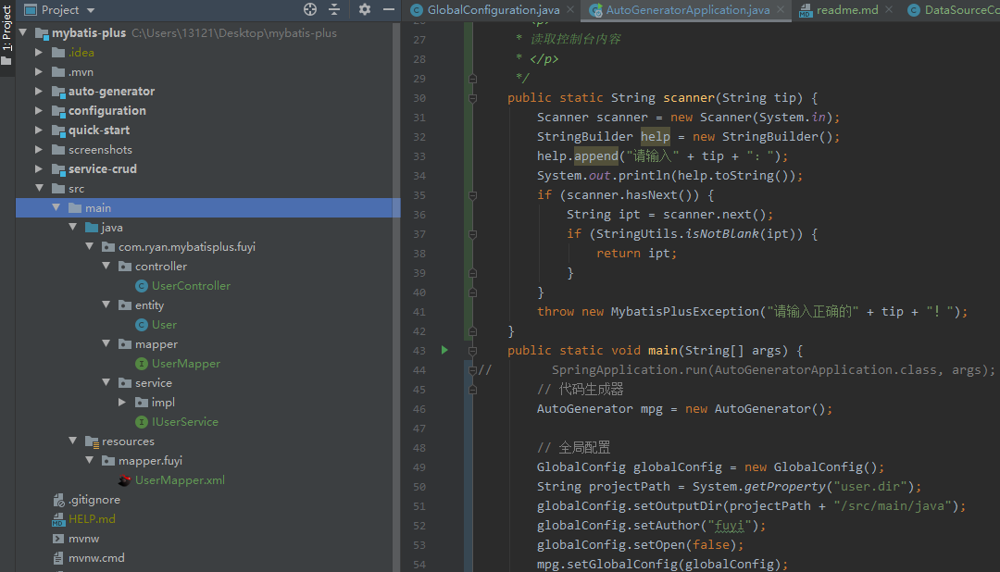

# 代码生成器

作用：可以快速生成Mapper，service，entity和xml文件代码，提高开发效率

- 工程环境搭建

    - 添加依赖
    
    ```xml
    <?xml version="1.0" encoding="UTF-8"?>
    <project xmlns="http://maven.apache.org/POM/4.0.0" xmlns:xsi="http://www.w3.org/2001/XMLSchema-instance"
             xsi:schemaLocation="http://maven.apache.org/POM/4.0.0 https://maven.apache.org/xsd/maven-4.0.0.xsd">
        <modelVersion>4.0.0</modelVersion>
        <parent>
            <groupId>org.springframework.boot</groupId>
            <artifactId>spring-boot-starter-parent</artifactId>
            <version>2.3.3.RELEASE</version>
            <relativePath/> <!-- lookup parent from repository -->
        </parent>
        <groupId>com.Ryan</groupId>
        <artifactId>auto-generator</artifactId>
        <version>0.0.1-SNAPSHOT</version>
        <name>auto-generator</name>
        <description>Demo project for Spring Boot</description>
    
        <properties>
            <java.version>1.8</java.version>
        </properties>
    
        <dependencies>
            <dependency>
                <groupId>org.springframework.boot</groupId>
                <artifactId>spring-boot-starter</artifactId>
            </dependency>
    
            <dependency>
                <groupId>org.springframework.boot</groupId>
                <artifactId>spring-boot-starter-test</artifactId>
                <scope>test</scope>
                <exclusions>
                    <exclusion>
                        <groupId>org.junit.vintage</groupId>
                        <artifactId>junit-vintage-engine</artifactId>
                    </exclusion>
                </exclusions>
            </dependency>
    
            <!--        配置Mysql依赖-->
            <dependency>
                <groupId>mysql</groupId>
                <artifactId>mysql-connector-java</artifactId>
                <version>5.1.49</version>
                <scope>runtime</scope>
            </dependency>
    
            <!--        配置lombok依赖-->
            <dependency>
                <groupId>org.projectlombok</groupId>
                <artifactId>lombok</artifactId>
                <optional>true</optional>
            </dependency>
    
            <!--        配置Mybatis-plus依赖-->
            <dependency>
                <groupId>com.baomidou</groupId>
                <artifactId>mybatis-plus-boot-starter</artifactId>
                <version>3.4.0</version>
            </dependency>
    
            <!--freemarker代码生成模板引擎-->
            <dependency>
                <groupId>org.freemarker</groupId>
                <artifactId>freemarker</artifactId>
                <version>2.3.30</version>
            </dependency>
    
        </dependencies>
    
        <build>
            <plugins>
                <plugin>
                    <groupId>org.springframework.boot</groupId>
                    <artifactId>spring-boot-maven-plugin</artifactId>
                </plugin>
            </plugins>
        </build>
    
    </project>
    ```
  - 编写配置Java类
  
    **[更多参数配置详情](https://baomidou.com/config/generator-config.html#drivername)**
  
  ```java
    package com.ryan.autogenerator;
    
    import com.baomidou.mybatisplus.annotation.DbType;
    import com.baomidou.mybatisplus.annotation.FieldFill;
    import com.baomidou.mybatisplus.annotation.IdType;
    import com.baomidou.mybatisplus.core.exceptions.MybatisPlusException;
    import com.baomidou.mybatisplus.core.mapper.BaseMapper;
    import com.baomidou.mybatisplus.core.toolkit.StringPool;
    import com.baomidou.mybatisplus.core.toolkit.StringUtils;
    import com.baomidou.mybatisplus.generator.AutoGenerator;
    import com.baomidou.mybatisplus.generator.InjectionConfig;
    import com.baomidou.mybatisplus.generator.config.*;
    import com.baomidou.mybatisplus.generator.config.po.TableFill;
    import com.baomidou.mybatisplus.generator.config.po.TableInfo;
    import com.baomidou.mybatisplus.generator.config.rules.DateType;
    import com.baomidou.mybatisplus.generator.config.rules.NamingStrategy;
    import com.baomidou.mybatisplus.generator.engine.FreemarkerTemplateEngine;
    import org.mybatis.spring.annotation.MapperScan;
    import org.springframework.boot.SpringApplication;
    import org.springframework.boot.autoconfigure.SpringBootApplication;
    
    import java.util.ArrayList;
    import java.util.Arrays;
    import java.util.List;
    import java.util.Scanner;
    
    @SpringBootApplication
    
    public class AutoGeneratorApplication {
    
        /**
         * <p>
         * 读取控制台内容
         * </p>
         */
        public static String scanner(String tip) {
            Scanner scanner = new Scanner(System.in);
            StringBuilder help = new StringBuilder();
            help.append("请输入" + tip + "：");
            System.out.println(help.toString());
            if (scanner.hasNext()) {
                String ipt = scanner.next();
                if (StringUtils.isNotBlank(ipt)) {
                    return ipt;
                }
            }
            throw new MybatisPlusException("请输入正确的" + tip + "！");
        }
        public static void main(String[] args) {
                // 代码生成器
                AutoGenerator mpg = new AutoGenerator();
    
                // 全局配置
                GlobalConfig globalConfig = new GlobalConfig();
                String projectPath = System.getProperty("user.dir");
                globalConfig.setOutputDir(projectPath + "/src/main/java");
                globalConfig.setAuthor("fuyi");
                globalConfig.setFileOverride(false); //文件是否覆盖
                globalConfig.setServiceName("%sService"); //去Service前缀I
                globalConfig.setOpen(false);              //是否打开资源管理器
                globalConfig.setIdType(IdType.ID_WORKER); //设置主键id策略
                globalConfig.setDateType(DateType.ONLY_DATE); //设置日期格式使用 java.util.date 代替
                globalConfig.setSwagger2(true);            //配置Swagger文档
                mpg.setGlobalConfig(globalConfig);
    
                //数据源配置
                DataSourceConfig dataSourceConfig = new DataSourceConfig();
                dataSourceConfig.setUrl("jdbc:mysql://47.112.240.174:3306/mybatis-plus?useUnicode=true&useSSL=false&characterEncoding=utf8");
                dataSourceConfig.setDbType(DbType.MYSQL);      //设置支持的数据类型
                dataSourceConfig.setDriverName("com.mysql.jdbc.Driver");
                dataSourceConfig.setUsername("root");
                dataSourceConfig.setPassword("MyNewPass4!");
                mpg.setDataSource(dataSourceConfig);
    
                // 包配置
                PackageConfig pc = new PackageConfig();
                pc.setModuleName(scanner("模块名"));
                pc.setParent("com.ryan");
                pc.setEntity("entity");
                pc.setMapper("mapper");
                pc.setService("service");
                pc.setController("controller");
                mpg.setPackageInfo(pc);
    
                // 自定义配置
                InjectionConfig cfg = new InjectionConfig() {
                    @Override
                    public void initMap() {
                        // to do nothing
                    }
                };
    
                // 如果模板引擎是 freemarker
                String templatePath = "/templates/mapper.xml.ftl";
    
                // 自定义输出配置
                List<FileOutConfig> focList = new ArrayList<>();
                // 自定义配置会被优先输出
                focList.add(new FileOutConfig(templatePath) {
                    @Override
                    public String outputFile(TableInfo tableInfo) {
                        // 自定义输出文件名 ， 如果你 Entity 设置了前后缀、此处注意 xml 的名称会跟着发生变化！！
                        return projectPath + "/src/main/resources/mapper/" + pc.getModuleName()
                                + "/" + tableInfo.getEntityName() + "Mapper" + StringPool.DOT_XML;
                    }
                });
                cfg.setFileOutConfigList(focList);
                mpg.setCfg(cfg);
    
                // 配置模板
                TemplateConfig templateConfig = new TemplateConfig();
                templateConfig.setXml(null);
                mpg.setTemplate(templateConfig);
    
                // 策略配置
                StrategyConfig strategy = new StrategyConfig();
                strategy.setInclude(scanner("表名，多个英文逗号分割").split(","));   //设置映射的表名
                strategy.setNaming(NamingStrategy.underline_to_camel);          //设置驼峰命名
                strategy.setColumnNaming(NamingStrategy.underline_to_camel);    //列名直接转驼峰
                strategy.setEntityLombokModel(true);                            //自动生成Lombok
                strategy.setRestControllerStyle(true);                          //开启Controller驼峰命名规则
                strategy.setLogicDeleteFieldName(scanner("逻辑删除的列名"));             //设置逻辑删除的列名字段
    
                //自动填充策略配置
                TableFill createTime = new TableFill("create_time", FieldFill.INSERT);
                TableFill updateTime = new TableFill("update_time", FieldFill.INSERT_UPDATE);
                strategy.setTableFillList(Arrays.asList(createTime, updateTime));
    
                //乐观锁配置
                strategy.setVersionFieldName(scanner("乐观锁字段"));
    
                mpg.setStrategy(strategy);
                mpg.setTemplateEngine(new FreemarkerTemplateEngine());
                mpg.execute();
            }
    
    
    }

   ```
  
  - 执行结果
  
  ```text
  "C:\Program Files\Java\jdk1.8.0_261\bin\java.exe" -XX:TieredStopAtLevel=1 -noverify -Dspring.output.ansi.enabled=always -Dcom.sun.management.jmxremote -Dspring.jmx.enabled=true -Dspring.liveBeansView.mbeanDomain -Dspring.application.admin.enabled=true "-javaagent:J:\install\IntelliJ IDEA 2019.2.4\lib\idea_rt.jar=51539:J:\install\IntelliJ IDEA 2019.2.4\bin" -Dfile.encoding=UTF-8 -classpath "C:\Program Files\Java\jdk1.8.0_261\jre\lib\charsets.jar;C:\Program Files\Java\jdk1.8.0_261\jre\lib\deploy.jar;C:\Program Files\Java\jdk1.8.0_261\jre\lib\ext\access-bridge-64.jar;C:\Program Files\Java\jdk1.8.0_261\jre\lib\ext\cldrdata.jar;C:\Program Files\Java\jdk1.8.0_261\jre\lib\ext\dnsns.jar;C:\Program Files\Java\jdk1.8.0_261\jre\lib\ext\jaccess.jar;C:\Program Files\Java\jdk1.8.0_261\jre\lib\ext\jfxrt.jar;C:\Program Files\Java\jdk1.8.0_261\jre\lib\ext\localedata.jar;C:\Program Files\Java\jdk1.8.0_261\jre\lib\ext\nashorn.jar;C:\Program Files\Java\jdk1.8.0_261\jre\lib\ext\sunec.jar;C:\Program Files\Java\jdk1.8.0_261\jre\lib\ext\sunjce_provider.jar;C:\Program Files\Java\jdk1.8.0_261\jre\lib\ext\sunmscapi.jar;C:\Program Files\Java\jdk1.8.0_261\jre\lib\ext\sunpkcs11.jar;C:\Program Files\Java\jdk1.8.0_261\jre\lib\ext\zipfs.jar;C:\Program Files\Java\jdk1.8.0_261\jre\lib\javaws.jar;C:\Program Files\Java\jdk1.8.0_261\jre\lib\jce.jar;C:\Program Files\Java\jdk1.8.0_261\jre\lib\jfr.jar;C:\Program Files\Java\jdk1.8.0_261\jre\lib\jfxswt.jar;C:\Program Files\Java\jdk1.8.0_261\jre\lib\jsse.jar;C:\Program Files\Java\jdk1.8.0_261\jre\lib\management-agent.jar;C:\Program Files\Java\jdk1.8.0_261\jre\lib\plugin.jar;C:\Program Files\Java\jdk1.8.0_261\jre\lib\resources.jar;C:\Program Files\Java\jdk1.8.0_261\jre\lib\rt.jar;U:\Ryan\Blog\mybatis-plus\auto-generator\target\classes;C:\Users\小黑\.m2\repository\org\springframework\boot\spring-boot-starter\2.3.3.RELEASE\spring-boot-starter-2.3.3.RELEASE.jar;C:\Users\小黑\.m2\repository\org\springframework\boot\spring-boot\2.3.3.RELEASE\spring-boot-2.3.3.RELEASE.jar;C:\Users\小黑\.m2\repository\org\springframework\spring-context\5.2.8.RELEASE\spring-context-5.2.8.RELEASE.jar;C:\Users\小黑\.m2\repository\org\springframework\spring-aop\5.2.8.RELEASE\spring-aop-5.2.8.RELEASE.jar;C:\Users\小黑\.m2\repository\org\springframework\spring-beans\5.2.8.RELEASE\spring-beans-5.2.8.RELEASE.jar;C:\Users\小黑\.m2\repository\org\springframework\spring-expression\5.2.8.RELEASE\spring-expression-5.2.8.RELEASE.jar;C:\Users\小黑\.m2\repository\org\springframework\boot\spring-boot-autoconfigure\2.3.3.RELEASE\spring-boot-autoconfigure-2.3.3.RELEASE.jar;C:\Users\小黑\.m2\repository\org\springframework\boot\spring-boot-starter-logging\2.3.3.RELEASE\spring-boot-starter-logging-2.3.3.RELEASE.jar;C:\Users\小黑\.m2\repository\ch\qos\logback\logback-classic\1.2.3\logback-classic-1.2.3.jar;C:\Users\小黑\.m2\repository\ch\qos\logback\logback-core\1.2.3\logback-core-1.2.3.jar;C:\Users\小黑\.m2\repository\org\apache\logging\log4j\log4j-to-slf4j\2.13.3\log4j-to-slf4j-2.13.3.jar;C:\Users\小黑\.m2\repository\org\apache\logging\log4j\log4j-api\2.13.3\log4j-api-2.13.3.jar;C:\Users\小黑\.m2\repository\org\slf4j\jul-to-slf4j\1.7.30\jul-to-slf4j-1.7.30.jar;C:\Users\小黑\.m2\repository\jakarta\annotation\jakarta.annotation-api\1.3.5\jakarta.annotation-api-1.3.5.jar;C:\Users\小黑\.m2\repository\org\springframework\spring-core\5.2.8.RELEASE\spring-core-5.2.8.RELEASE.jar;C:\Users\小黑\.m2\repository\org\springframework\spring-jcl\5.2.8.RELEASE\spring-jcl-5.2.8.RELEASE.jar;C:\Users\小黑\.m2\repository\org\yaml\snakeyaml\1.26\snakeyaml-1.26.jar;C:\Users\小黑\.m2\repository\org\slf4j\slf4j-api\1.7.30\slf4j-api-1.7.30.jar;C:\Users\小黑\.m2\repository\mysql\mysql-connector-java\5.1.49\mysql-connector-java-5.1.49.jar;C:\Users\小黑\.m2\repository\org\projectlombok\lombok\1.18.12\lombok-1.18.12.jar;C:\Users\小黑\.m2\repository\org\freemarker\freemarker\2.3.30\freemarker-2.3.30.jar;C:\Users\小黑\.m2\repository\com\baomidou\mybatis-plus-generator\3.4.0\mybatis-plus-generator-3.4.0.jar;C:\Users\小黑\.m2\repository\com\baomidou\mybatis-plus-extension\3.4.0\mybatis-plus-extension-3.4.0.jar;C:\Users\小黑\.m2\repository\com\baomidou\mybatis-plus-core\3.4.0\mybatis-plus-core-3.4.0.jar;C:\Users\小黑\.m2\repository\com\baomidou\mybatis-plus-annotation\3.4.0\mybatis-plus-annotation-3.4.0.jar;C:\Users\小黑\.m2\repository\com\github\jsqlparser\jsqlparser\3.2\jsqlparser-3.2.jar;C:\Users\小黑\.m2\repository\org\mybatis\mybatis\3.5.5\mybatis-3.5.5.jar;C:\Users\小黑\.m2\repository\org\mybatis\mybatis-spring\2.0.5\mybatis-spring-2.0.5.jar" com.ryan.autogenerator.AutoGeneratorApplication
  请输入模块名：
  autocond
  请输入表名，多个英文逗号分割：
  user
  请输入逻辑删除的列名：
  deleted
  请输入乐观锁字段：
  version
  23:50:38.960 [main] DEBUG com.baomidou.mybatisplus.generator.AutoGenerator - ==========================准备生成文件...==========================
  23:50:39.555 [main] DEBUG com.baomidou.mybatisplus.generator.engine.AbstractTemplateEngine - 创建目录： [U:\Ryan\Blog\mybatis-plus/src/main/java\com\ryan\autocond\entity]
  23:50:39.556 [main] DEBUG com.baomidou.mybatisplus.generator.engine.AbstractTemplateEngine - 创建目录： [U:\Ryan\Blog\mybatis-plus/src/main/java\com\ryan\autocond\controller]
  23:50:39.556 [main] DEBUG com.baomidou.mybatisplus.generator.engine.AbstractTemplateEngine - 创建目录： [U:\Ryan\Blog\mybatis-plus/src/main/java\com\ryan\autocond\mapper]
  23:50:39.557 [main] DEBUG com.baomidou.mybatisplus.generator.engine.AbstractTemplateEngine - 创建目录： [U:\Ryan\Blog\mybatis-plus/src/main/java\com\ryan\autocond\service\impl]
  23:50:39.614 [main] DEBUG com.baomidou.mybatisplus.generator.engine.AbstractTemplateEngine - 模板:/templates/mapper.xml.ftl;  文件:U:\Ryan\Blog\mybatis-plus/src/main/resources/mapper/autocond/UserMapper.xml
  23:50:39.751 [main] DEBUG com.baomidou.mybatisplus.generator.engine.AbstractTemplateEngine - 模板:/templates/entity.java.ftl;  文件:U:\Ryan\Blog\mybatis-plus/src/main/java\com\ryan\autocond\entity\User.java
  23:50:39.753 [main] DEBUG com.baomidou.mybatisplus.generator.engine.AbstractTemplateEngine - 模板:/templates/mapper.java.ftl;  文件:U:\Ryan\Blog\mybatis-plus/src/main/java\com\ryan\autocond\mapper\UserMapper.java
  23:50:39.758 [main] DEBUG com.baomidou.mybatisplus.generator.engine.AbstractTemplateEngine - 模板:/templates/service.java.ftl;  文件:U:\Ryan\Blog\mybatis-plus/src/main/java\com\ryan\autocond\service\UserService.java
  23:50:39.764 [main] DEBUG com.baomidou.mybatisplus.generator.engine.AbstractTemplateEngine - 模板:/templates/serviceImpl.java.ftl;  文件:U:\Ryan\Blog\mybatis-plus/src/main/java\com\ryan\autocond\service\impl\UserServiceImpl.java
  23:50:39.769 [main] DEBUG com.baomidou.mybatisplus.generator.engine.AbstractTemplateEngine - 模板:/templates/controller.java.ftl;  文件:U:\Ryan\Blog\mybatis-plus/src/main/java\com\ryan\autocond\controller\UserController.java
  23:50:39.769 [main] DEBUG com.baomidou.mybatisplus.generator.AutoGenerator - ==========================文件生成完成！！！==========================
  
  Process finished with exit code 0
  ```
  
  - 结果
  
  
  

    