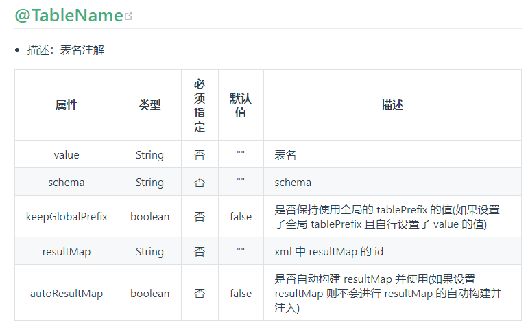
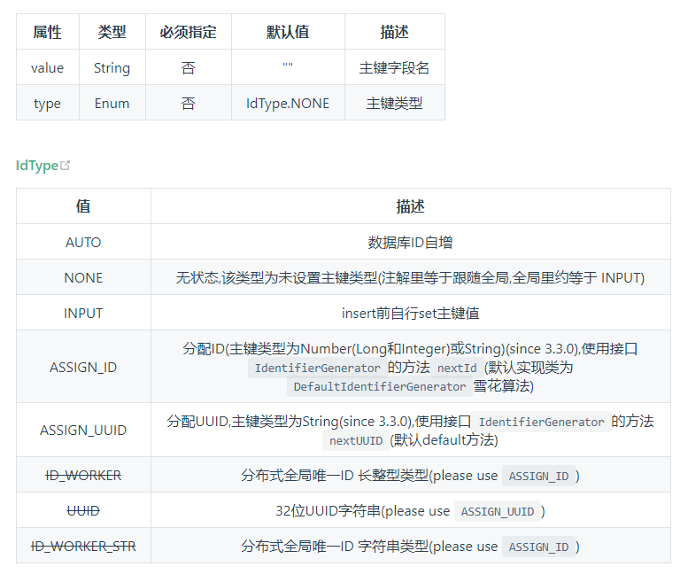
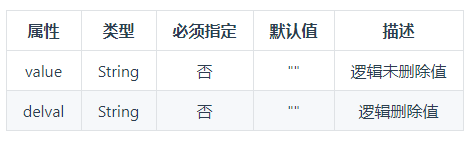

# mybatis-plus
SpringBoot整合Mybatis-Plus学习

[官方地址](https://baomidou.com/)

# 体验Mybatis-plus

- 创建数据库并且插入数据

```jshelllanguage

DROP TABLE IF EXISTS USER;

CREATE TABLE USER
(
	id BIGINT(20) NOT NULL COMMENT '主键ID',
	NAME VARCHAR(30) NULL DEFAULT NULL COMMENT '姓名',
	age INT(11) NULL DEFAULT NULL COMMENT '年龄',
	email VARCHAR(50) NULL DEFAULT NULL COMMENT '邮箱',
	PRIMARY KEY (id)
);

INSERT INTO USER (id, NAME, age, email) VALUES
(1, 'Jone', 18, 'test1@baomidou.com'),
(2, 'Jack', 20, 'test2@baomidou.com'),
(3, 'Tom', 28, 'test3@baomidou.com'),
(4, 'Sandy', 21, 'test4@baomidou.com'),
(5, 'Billie', 24, 'test5@baomidou.com');

SELECT * FROM USER;
```

- 初始化工程
    - 添加依赖
    
    ```xml
    
   #数据源配置
   spring:
      datasource:
      driver-class-name: com.mysql.jdbc.Driver
      url: jdbc:mysql://localhost:3306/mybatis-plus?useSSL=false&useUnicode=true&characterEncoding=utf-8
      username: root
      password: 123456


    ```

    - 编写实体类

    ```java
    package com.ryan.quickstart.entity;
    
    import lombok.Data;
    
    @Data
    public class User {
    
        private int id;
        private String name;
        private int age;
        private String email;
    }
   ```

    - Spring Boot 启动类中添加 @MapperScan 注解，扫描 Mapper 文件夹

    ```java
    package com.ryan.quickstart;
    
    import org.mybatis.spring.annotation.MapperScan;
    import org.springframework.boot.SpringApplication;
    import org.springframework.boot.autoconfigure.SpringBootApplication;
    
    @SpringBootApplication
    @MapperScan(value = "com.ryan.quickstart.mapper")
    public class QuickStartApplication {
    
        public static void main(String[] args) {
            SpringApplication.run(QuickStartApplication.class, args);
        }
    
    }
    
    ```

    - 编写Mapper类

    ```java
    
    package com.ryan.quickstart.mapper;
    
    import com.baomidou.mybatisplus.core.mapper.BaseMapper;
    import com.ryan.quickstart.entity.User;
    
    public interface UserMapper extends BaseMapper<User> {
    }
    
    ```

    - 编写测试类

    ```java
    package com.ryan.quickstart;
    
    import com.ryan.quickstart.entity.User;
    import com.ryan.quickstart.mapper.UserMapper;
    import org.junit.Assert;
    import org.junit.Test;
    import org.junit.runner.RunWith;
    import org.springframework.boot.test.context.SpringBootTest;
    import org.springframework.test.context.junit4.SpringRunner;
    
    import javax.annotation.Resource;
    import java.util.List;
    
    @RunWith(SpringRunner.class)
    @SpringBootTest
    public class MybatisPlusTest {
    
        @Resource
        private UserMapper userMapper;
    
    
        @Test
        public void testSelect() {
            System.out.println(("----- selectAll method test ------"));
            List<User> userList = userMapper.selectList(null);
            Assert.assertEquals(5, userList.size());
            userList.forEach(System.out::println);
        }
    
    }
    
    ```
  
    - 结果输出
    
    ```java
    User(id=1, name=Jone, age=18, email=test1@baomidou.com)
    User(id=2, name=Jack, age=20, email=test2@baomidou.com)
    User(id=3, name=Tom, age=28, email=test3@baomidou.com)
    User(id=4, name=Sandy, age=21, email=test4@baomidou.com)
    User(id=5, name=Billie, age=24, email=test5@baomidou.com)
    ```
  
  
- 小结

    相对于Mybatis来说，Mybatis-plus更加的简洁，只需要导入依赖，并配置扫描Mapper路径就可以了，就可以完成简单的CURD操作了。
    
    

# 注解（annotation）

@TableName

description： 表名注解

Attribute value：
    
   
   
@TableId

description：主键注解

Attribute value：
   
   

@TableField

description：字段注解（非主键）

Attribute value

```t```

| 属性        | 类型    |  必须指定  |  默认值  | 描述  |
    | --------   | -----:   | :----: |:----: |:----: |
    | value       | String      |   否    | ""    |   数据库字段名    |
    | exist        | Boolean      |   否    | true   |   是否为数据库表字段    |
    | el        | String     |   否    | ""    |   映射为原生 #{ ... } 逻辑,相当于写在 xml 里的 #{ ... } 部分    |


@Version

description：乐观锁注解、标记 @Verison 在字段上

@EnumValue

description:通枚举类注解(注解在枚举字段上)

Attribute value


@TableLogic

description:表字段逻辑处理注解（逻辑删除）

value




@SqlParser

description：租户注解,支持method上以及mapper接口上

value


@KeySequence

description：序列主键策略 oracle

value：value、resultMap


